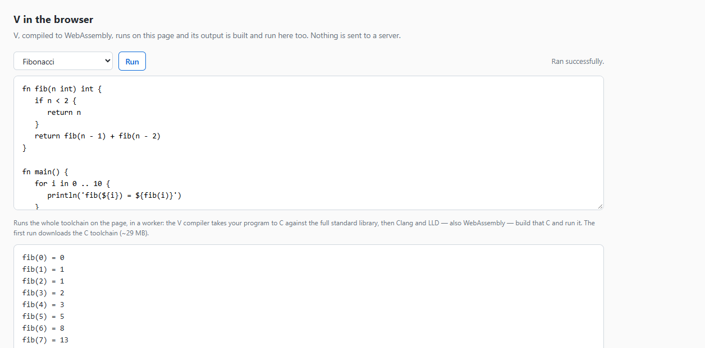

# browser-v

Proof of concept: **compile and run V (vlang) in the browser, with no server.**

Everything runs on the page, in a Web Worker:

```
your V  ->  v.wasm (the V compiler)  ->  main.c  ->  Clang + LLD in wasm  ->  your program runs
```

The V compiler is itself a WebAssembly module built from a pinned V commit, and so is the C toolchain
that finishes the job. Nothing is sent anywhere; there is no compilation backend.

```bash
npm install
npm run setup:clang      # copies the C toolchain's assets into assets/clang (~29 MB)
npm start                # http://localhost:4180
```

`npm start` is a plain static file server (Node, no dependencies). It exists only because the page
fetches `.wasm` assets and uses a Worker, which browsers require a real origin for. It is not a
compilation server.



## Status

**Working.** A program typed into the page is compiled and run, and its output appears:

```
Ran successfully.
fib(0) = 0
fib(1) = 1
fib(2) = 1
...
```

Six sample programs are verified end to end — hello world, recursion, string interpolation, arrays
and loops, `import math` (the standard library), and structs with methods — and V's own diagnostics
come through for a program that does not compile, with the source line and a caret.

## How it works, and why it takes two compilers

The obvious plan is the old `v-wasm` playground's: compile with `v -b js`. That is gone — V 0.5.2 is
the self-hosted "V3" compiler and its driver states plainly *"V3 has no JavaScript backend"*
(`vlib/v/driver/driver.v:7597`).

`-b wasm` looks like the replacement, and is not:

```
$ v -b wasm -o main.wasm main.v
linking target wasm32_emscripten/wasm32 from host linux/amd64 is not supported by the default C
compiler; use -o file.c and compile it with a target toolchain
```

`-b wasm` selects the wasm32 source set but still generates **C**, then asks a C compiler to link it.
There is no native wasm code generator to reach. The one form that produces output is
`-b c -os wasm32_emscripten`, and the C it emits is **free of Emscripten**: a hello-world comes to
275 KB of plain libc C with zero occurrences of `emscripten` and no `__EMSCRIPTEN__` guards. So the
pipeline above is the short way round, and it is the same shape as the sibling `browser-nim` PoC
(Nim → C → clang-wasm → wasm).

| Stage | Runs where | What it is |
| --- | --- | --- |
| V → C | a worker, on the page | `assets/v.wasm`, the V compiler built from a pinned commit, unpacking `assets/vlib.tar` (the full standard library) |
| C → wasm | the same worker | `@live-codes/clang-wasm`: Clang 22 and LLD compiled to WebAssembly, with a `wasm32-wasi` sysroot |
| run | the same worker | the module is instantiated with a WASI preview-1 host and its stdout is posted back |

Both stages block whichever thread hosts them for seconds, which is why they are in a worker: the
page stays responsive, and a stuck compile can be cancelled by discarding the worker.

## What V's C needs before Clang will build it

V's C backend targets `wasm32_emscripten`, and the C it emits is portable — but it includes a batch of
POSIX headers. The sysroot that ships with `@live-codes/clang-wasm` used to be pruned to what a C++
demo needs (42 C headers), which was a defect rather than a policy: it kept `<unistd.h>` and dropped
the two headers `<unistd.h>` includes, so that header could not be preprocessed at all. The package now
restores wasi-libc's whole C header tree, and this page picks the fix up by re-staging `assets/clang/`
from it. `assets/v-clang-shims.js` — shared by the worker and the Node driver, so there is one copy —
is down from twenty-three entries to four:

- **Empty headers** for `netdb.h`, `sys/wait.h` and `termios.h`, which wasi-libc does not ship at all.
  Empty is deliberate: if one of them turns out to be needed, the compile says so rather than silently
  mis-declaring it.
- **`<stdatomic.h>`**, because that one is Clang's own header rather than libc's, and the packaged
  Clang resource directory is pruned to the seventeen headers `<stdarg.h>` and `<stddef.h>` need. V
  does its atomics with clang's `__atomic_*` builtins, so only the names the preamble touches are
  declared.
- **A `getpid()` definition.** WASI has no process ids and wasi-libc only emulates `getpid()` behind a
  define plus a library the runtime's link line does not carry. V's C calls it once, for a seed.
- **Feature flags rather than files** for the four headers wasi-libc does ship but refuses to compile
  without an opt-in: `-D_WASI_EMULATED_MMAN`, `-D_WASI_EMULATED_SIGNAL`,
  `-D_WASI_EMULATED_PROCESS_CLOCKS`, and `-D__wasm_exception_handling__` for `<setjmp.h>`. Passing the
  flag keeps the sysroot's own declarations, which is what a stub could not do. Nothing in the
  generated C calls `mmap`, `signal` or `setjmp`, and none of the emulation libraries are on the
  runtime's link line.

One more thing: V's generated C includes a few of its own files by **absolute path**
(`#include "/v/vlib/builtin/..."`), because the compiler was built with its root at `/v`. The
toolchain's filesystem is a different one, so those files are copied across from the compiler's
filesystem — which already has the whole tree — following nested includes. That is why a program using
closures works without anything else being vendored.

And the compile itself is made with `-gc none`: the target otherwise asks for the Boehm GC, whose
`<gc.h>` does not exist here, and short playground programs do not need a collector.

## Building the compiler assets

The V compiler is not taken from anyone else's build. It is built from a pinned commit inside a
container, and the same inputs always produce the same artifacts:

```bash
npm run build:assets       # docker build --output type=local,dest=./assets build
```

`build/Dockerfile` runs `build/build-v-wasm.sh`: fetch V at a pinned commit, patch it (below),
bootstrap a native V, build a native V3 from the pinned sources, generate C for the compiler with
`-os wasm32_emscripten`, compile that C to `v.js` + `v.wasm` with `emcc`, pack the standard library
into `vlib.tar`, and write `receipt.json` with the V commit, the emcc version and the SHA-256 of every
artifact.

`vlib.tar` is pruned to what compiling a program can reach — the library sources without test files,
docs or the compiler's own `vlib/v` tree, whose sources are already compiled into `v.wasm`. That takes
it from 45 MB to 15 MB. Three things under `vlib/v` are added back because they *are* read at run
time: the header behind an `$embed_file` and the preludes the compiler injects.

## Patches the compiler needs

Everything below is applied by `build/build-v-wasm.sh`; nothing is hand-edited. Each exists because
the wasm build has no C toolchain and no threads, and V's compiler assumes both.

| Patch | Why |
| --- | --- |
| `vlib/os/os.v` — a `$if wasm32_emscripten` branch in `user_os()` | Without it the compiler reports its own host as `unknown/wasm32` and panics on startup: *"unsupported compiler host target unknown/wasm32"*. |
| `should_overlap_v3_native_inputs()` → `false` | Its second clause (`!native_inputs_needed && scope_prealloc_stages`) is true here, so V runs the native-input scan on a spawned thread. Our synchronous pthread stub runs the thread body inline, and that body waits for a release the caller only sends *after* `spawn` returns — a deadlock. |
| `prepare_v3_checker_native_inputs()` and `prepare_v3_cache_external_inputs_scoped()` → return immediately | The one that took longest to find. Before checking, V resolves "native inputs" by asking the C compiler for its predefined macros and following `#include` paths. There is no C compiler in the browser, and that scan never returns — it spins at 100% CPU. Nothing needs the manifest here, because a program compiled in this PoC has no C interop. |
| `vlib/v/gen/c/output_nix.c.v` — write the C sequentially under `$if wasm32_emscripten` | V publishes the generated C through an `mmap(MAP_SHARED)` of the output file and relies on the shared mapping to write the bytes back. Emscripten's mmap of an in-memory file does not, so the file came out at exactly the right size and full of NUL. |
| `-Wl,--wrap=pthread_create`, `pthread_join` → `build/v-wasm-stubs.c` | V's compiler spawns threads (a parallel-checker pool, plus work it overlaps with checking). Emscripten's wasm32 sysroot has no pthreads. The stub runs the thread body immediately and keeps its result for the matching join, so `spawn` becomes synchronous. |
| `-Wl,--wrap=sem_*` | V's `sync.Semaphore` sits on POSIX semaphores, which the sysroot lacks — without this, `sem_wait` returns `ENOSYS` and the compiler panics with *"Function not implemented"*. The stub is a counter that never blocks. |
| `-no-parallel` at run time | The synchronous thread stubs are only sound with the worker pool off: pooled workers coordinate over channels and would deadlock if run one after another. |

Going the other way — Emscripten pthreads — would mean `SharedArrayBuffer` and therefore COOP/COEP on
the embedding page, which a playground should not require. The same trade-off appears in the C stage:
the Clang runtime tests `instanceof SharedArrayBuffer` unconditionally, so the worker stubs it out and
the page needs no cross-origin isolation.

## Working on it

The browser is a poor debugger for a compiler that blocks its thread, so both the compiler build and
the toolchain can be driven from Node, against the very same artifacts the page uses:

```bash
node build/dev-compile.cjs build/out "" -new-compiler -b c -os wasm32_emscripten -no-parallel -gc none -o /main.c /main.v
#   with DUMP_C=build/out/v-out.c to keep the generated C
node build/dev-run.mjs build/out/v-out.c
```

`dev-compile.cjs` runs the compiler and dumps the C; `dev-run.mjs` builds and runs that C through the
toolchain, with the same shims. `-v` (V's phase trace) plus `DRIVER_TRACE=1` markers in the driver are
how the two stalls above were narrowed to a function, and `STUB_DEBUG=1` instruments the thread stubs.
Both are off by default.

## What was verified

- The pipeline builds `v.js`, `v.wasm` and `vlib.tar` from commit `e1ec6137`; `receipt.json` records
  their hashes.
- Six sample programs compile, build and run on the page, including `import math`.
- V's diagnostics come through with source context and the ANSI colour stripped.
- The same artifacts run from Node (compiler and toolchain), which is how the stages were developed.

## Known limitations

- **~29 MB of toolchain assets**, fetched on the first run and kept warm after that; the first compile
  of a session is the slow one.
- **`v.wasm` is unoptimised (~18 MB)** — built `-O0`. It is downloaded on every page load, so it is the
  most obvious thing to improve. `EMCC_OPT` selects the level and defaults to `-O1`; binaryen at `-O2`
  on a module this size takes tens of minutes.
- **C interop is disabled** in the compiler, a consequence of skipping the native-input scan: a program
  using `#include` / `#flag` against C headers will not resolve them.
- **Programs are compiled `-gc none`**, so a long-running program grows memory rather than collecting.
- **No stdin or argv yet.** The program runs with a WASI preview-1 environment and no preopened
  directories, so file I/O inside the program will fail.
- **`getpid()` always returns 1**, since WASI has no process ids.
- **The memfs is not shared.** The compiler's filesystem and the toolchain's are separate, which is why
  the absolute includes have to be copied across.

## Files

| File | Purpose |
| --- | --- |
| `index.html` | The page: editor, samples, status, output. |
| `assets/compile-worker.js` | The worker: V compiler → C → toolchain → run. |
| `assets/v-clang-shims.js` | The few headers V's C needs that wasi-libc and Clang still lack, plus the feature flags (shared with the Node driver). |
| `assets/v.js`, `assets/v.wasm` | The V compiler, built by the pipeline. |
| `assets/vlib.tar` | The V standard library the compiler compiles against (15 MB, pruned). |
| `assets/clang/` | The C toolchain's assets, copied from the npm package by `npm run setup:clang`. Not committed. |
| `build/Dockerfile`, `build/build-v-wasm.sh` | The build pipeline for the compiler. |
| `build/v-wasm-stubs.c` | The synchronous pthread/semaphore implementations. |
| `build/dev-compile.cjs`, `build/dev-run.mjs` | The same two stages, driven from Node. |
| `scripts/setup-clang.mjs` | Copies the toolchain assets into `assets/clang`. |
| `serve.mjs` | A dependency-free static file server, for local use. |

## Provenance and licensing

- `assets/v.js`, `assets/v.wasm` — built here from the V compiler at a pinned commit; V is MIT.
- `assets/vlib.tar` — the V standard library from the same commit; MIT.
- `assets/clang/` — `@live-codes/clang-wasm` (MIT): Clang and LLD compiled to WebAssembly, the
  `wasm32-wasi` sysroot, and memfs, all Apache-2.0 with the LLVM exception. Copied from the npm
  package rather than committed.
- Emscripten, used at build time only, is Apache-2.0 with the LLVM exception.
- Everything else is MIT.
